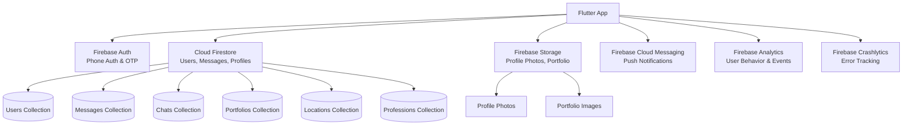
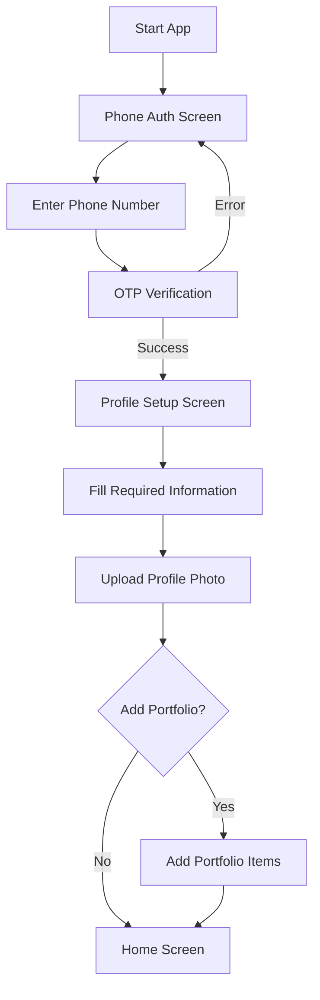
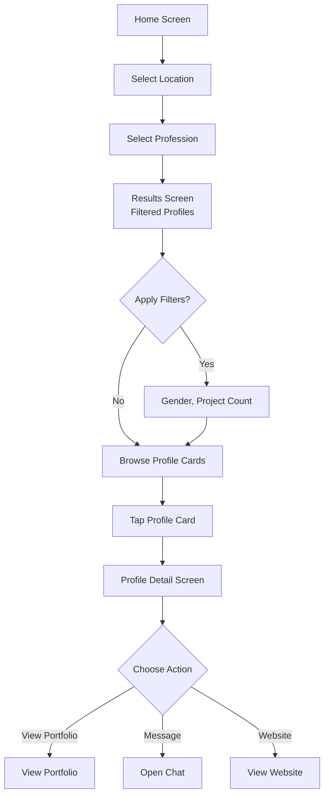
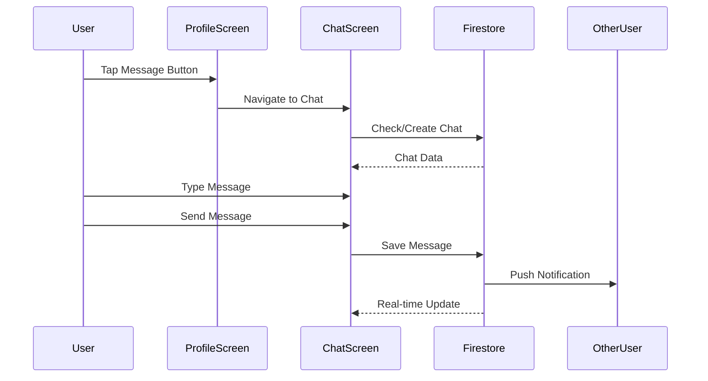
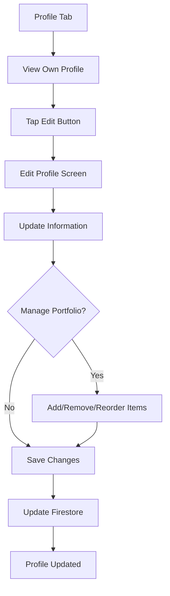
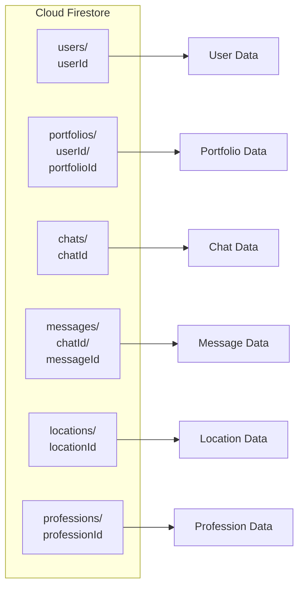

# Product Requirements Document (PRD)
## People Discovery App - Local Talent Finder

**Version:** 1.0  
**Date:** December 2024  
**Tech Stack:** Flutter + Firebase  
**Status:** Planning Phase

---

## 1. Executive Summary

### 1.1 Product Vision
A location-based mobile application that connects talented professionals within the same locality, enabling them to discover, connect, and collaborate with peers and adjacent professionals in their field.

### 1.2 Problem Statement
Professionals (especially freelancers, agency owners, and creative individuals) face significant challenges in:
- Finding talented individuals in their local area for hiring or collaboration
- Connecting with peers in the same profession for networking and collaboration
- Discovering professionals in adjacent fields for project partnerships
- Meeting people in person quickly and locally (unlike LinkedIn which is primarily online)

### 1.3 Solution Overview
A mobile app that allows users to:
1. Select a location (e.g., Bangalore)
2. Choose a profession (e.g., Website Designer, Video Editor)
3. Browse vetted profiles of professionals in that location and profession
4. View detailed profiles with portfolios, work samples, and contact information
5. Message and connect with professionals directly
6. Filter results based on various criteria

### 1.4 Target Users
- **Primary:** Agency owners, freelancers, creative professionals looking to hire or collaborate
- **Secondary:** Professionals seeking networking opportunities with peers in their field
- **Tertiary:** Anyone looking to find local talent for projects

---

## 2. Core Features & Requirements

### 2.1 Authentication & Onboarding

#### 2.1.1 Phone Number Authentication
- **Status:** ✅ Already Implemented
- Phone number-based authentication using Firebase Auth
- OTP verification via SMS
- Country code selection
- Auto-fill OTP support (where available)

#### 2.1.2 User Profile Setup (Post-Authentication)
- **Required Fields:**
  - Full Name
  - Profile Photo
  - Profession (from predefined list)
  - Location (City selection)
  - Bio/Description
  - Website URL (optional)
  - Social Media Links (Instagram, LinkedIn, Twitter, etc.)
  
- **Optional Fields:**
  - Years of Experience
  - Hourly Rate / Project Rate
  - Availability Status
  - Languages Spoken

#### 2.1.3 Portfolio Setup
- Upload work samples/images
- Add project descriptions
- Link to external portfolios
- Project count tracking

---

### 2.2 Home Screen

#### 2.2.1 Location Selection
- **UI Component:** Prominent location selector at top
- **Functionality:**
  - Searchable city list
  - Popular cities quick access
  - Current location detection (optional)
  - Recent locations history
- **Default:** Show user's selected location or "Select Location"

#### 2.2.2 Profession Selection
- **UI Component:** Grid or list of profession cards
- **Functionality:**
  - Scrollable list of available professions
  - Search/filter professions
  - Popular professions highlighted
  - Icons for each profession
- **Profession Categories (Initial Set):**
  - Website Designer
  - Video Editor
  - Graphic Designer
  - Photographer
  - Content Writer
  - Social Media Manager
  - UI/UX Designer
  - Developer (Frontend/Backend)
  - Marketing Specialist
  - Business Consultant
  - *[Expandable list - can be managed via Firebase]*

#### 2.2.3 Navigation
- Bottom navigation bar with:
  - Home (Discover)
  - Messages
  - Profile
  - Settings

---

### 2.3 Discovery/Results Screen

#### 2.3.1 Profile List View
- **Layout:** Card-based list
- **Card Components:**
  - Profile photo (circular)
  - Name
  - Profession
  - Location
  - Project count badge (e.g., "20-30 projects")
  - Rating/Reviews (future enhancement)
  - Distance from user (if location enabled)
  - Verification badge (if vetted)

#### 2.3.2 Filter Options
- **Gender Filter:**
  - All
  - Male
  - Female
  - Prefer not to say
  
- **Project Count Filter:**
  - All
  - 0-10 projects
  - 10-20 projects
  - 20-30 projects
  - 30-50 projects
  - 50+ projects

- **Additional Filters (Future):**
  - Experience level
  - Price range
  - Availability
  - Rating

#### 2.3.3 Search Functionality
- Search by name
- Search by skills/tags
- Search by location (refine city)

#### 2.3.4 Sorting Options
- Most recent
- Most projects
- Alphabetical
- Distance (if location enabled)

---

### 2.4 User Profile Detail Screen

#### 2.4.1 Profile Header Section
- Large profile photo
- Name
- Profession
- Location (with map pin icon)
- Verification status
- Edit button (if own profile)

#### 2.4.2 Key Information Section
- Project count (e.g., "20-30 projects completed")
- Years of experience
- Bio/Description
- Skills/Tags

#### 2.4.3 Action Buttons
- **Message Button:** Opens chat with user
- **View Website Button:** Opens external website in browser
- **Share Profile Button:** Share profile link
- **Report/Block Button:** Report inappropriate content

#### 2.4.4 Portfolio/Recent Work Section
- **Layout:** Horizontal scrollable gallery
- **Components:**
  - Work sample images
  - Project titles
  - Project descriptions (on tap)
  - Link to full portfolio (if available)
- **Display:** Grid or carousel view
- **Tap Action:** Full-screen image viewer with details

#### 2.4.5 Social Media Links
- **Display:** Icon buttons for each platform
- **Platforms:**
  - Instagram
  - LinkedIn
  - Twitter/X
  - Behance
  - Dribbble
  - GitHub (for developers)
  - Custom website
- **Action:** Open in external browser/app

#### 2.4.6 Additional Sections (Future)
- Reviews/Ratings
- Testimonials
- Availability calendar
- Pricing information

---

### 2.5 Messaging Feature

#### 2.5.1 Chat List Screen
- **Layout:** List of conversations
- **Components per conversation:**
  - Other user's profile photo
  - Name
  - Last message preview
  - Timestamp
  - Unread message indicator
- **Empty State:** "No messages yet. Start connecting with professionals!"

#### 2.5.2 Chat Screen
- **Header:**
  - Other user's profile photo and name
  - Online status indicator
  - View profile button
  
- **Message List:**
  - Text messages
  - Image sharing (future)
  - Timestamps
  - Read receipts (future)
  - Message status indicators (sending, sent, delivered, read)

- **Input Area:**
  - Text input field
  - Send button
  - Attachment button (future)
  - Emoji picker (future)

#### 2.5.3 Real-time Messaging
- Firebase Cloud Firestore for real-time message sync
- Push notifications for new messages
- Message persistence
- Offline message queuing

---

### 2.6 User Profile Management

#### 2.6.1 Edit Profile Screen
- All fields from profile setup (editable)
- Profile photo upload/change
- Portfolio management:
  - Add new work samples
  - Remove work samples
  - Reorder portfolio items
- Social media links management
- Privacy settings

#### 2.6.2 Settings Screen
- Account settings
- Notification preferences
- Privacy settings
- Blocked users list
- Logout option
- Delete account option

---

## 3. Technical Architecture

### 3.1 Technology Stack

#### 3.1.1 Frontend
- **Framework:** Flutter (Dart)
- **State Management:** Provider / Riverpod / Bloc (TBD)
- **UI Components:** Material Design 3
- **Image Handling:** Cached Network Images, Image Picker

#### 3.1.2 Backend & Services
- **Authentication:** Firebase Authentication
- **Database:** Cloud Firestore
- **Storage:** Firebase Storage (for images/portfolio)
- **Real-time:** Cloud Firestore real-time listeners
- **Notifications:** Firebase Cloud Messaging (FCM)
- **Analytics:** Firebase Analytics
- **Crash Reporting:** Firebase Crashlytics

### 3.2 Firebase Services Architecture



### 3.3 Data Models

#### 3.3.1 User Model
```dart
{
  userId: string (Firebase Auth UID),
  phoneNumber: string,
  displayName: string,
  email: string? (optional),
  profilePhotoUrl: string?,
  profession: string,
  location: {
    city: string,
    state: string?,
    country: string,
    coordinates: GeoPoint? (lat, lng)
  },
  bio: string?,
  website: string?,
  socialLinks: {
    instagram: string?,
    linkedin: string?,
    twitter: string?,
    behance: string?,
    dribbble: string?,
    github: string?
  },
  projectCount: number,
  yearsOfExperience: number?,
  gender: string? ('male' | 'female' | 'other' | 'prefer_not_to_say'),
  isVerified: boolean,
  createdAt: Timestamp,
  updatedAt: Timestamp,
  lastSeen: Timestamp,
  isActive: boolean
}
```

#### 3.3.2 Portfolio Item Model
```dart
{
  portfolioId: string,
  userId: string,
  imageUrl: string,
  thumbnailUrl: string?,
  title: string,
  description: string?,
  projectUrl: string?,
  tags: string[],
  createdAt: Timestamp,
  order: number (for sorting)
}
```

#### 3.3.3 Message Model
```dart
{
  messageId: string,
  chatId: string, // Combination of sorted userIds: "userId1_userId2"
  senderId: string,
  receiverId: string,
  messageText: string,
  messageType: string ('text' | 'image' | 'file'),
  imageUrl: string?,
  timestamp: Timestamp,
  isRead: boolean,
  readAt: Timestamp?
}
```

#### 3.3.4 Chat Model
```dart
{
  chatId: string, // Combination of sorted userIds
  participants: string[], // [userId1, userId2]
  lastMessage: {
    text: string,
    senderId: string,
    timestamp: Timestamp
  },
  unreadCount: {
    userId1: number,
    userId2: number
  },
  createdAt: Timestamp,
  updatedAt: Timestamp
}
```

#### 3.3.5 Location Model
```dart
{
  locationId: string,
  city: string,
  state: string?,
  country: string,
  coordinates: GeoPoint,
  isActive: boolean
}
```

#### 3.3.6 Profession Model
```dart
{
  professionId: string,
  name: string,
  icon: string? (icon name),
  category: string?,
  isActive: boolean,
  order: number (for sorting)
}
```

---

## 4. User Flows

### 4.1 Onboarding Flow



### 4.2 Discovery Flow



### 4.3 Messaging Flow



### 4.4 Profile Management Flow



---

## 5. UI/UX Requirements

### 5.1 Design Principles
- **Clean & Modern:** Minimalist design with focus on content
- **Fast & Responsive:** Smooth animations, quick load times
- **Intuitive Navigation:** Clear hierarchy, easy to understand
- **Mobile-First:** Optimized for mobile devices
- **Accessibility:** Support for screen readers, proper contrast ratios

### 5.2 Color Scheme
- Primary Color: Professional blue or brand color
- Secondary Color: Complementary accent color
- Background: Light gray/white
- Text: Dark gray/black for readability
- Accent: For CTAs and important actions

### 5.3 Typography
- Headings: Bold, clear hierarchy
- Body: Readable font size (14-16px)
- Buttons: Medium weight, clear labels

### 5.4 Key Screens Mockup Descriptions

#### 5.4.1 Home Screen
- Top: Location selector (prominent, tappable)
- Middle: Profession grid (2-3 columns, icons + text)
- Bottom: Navigation bar

#### 5.4.2 Results Screen
- Top: Search bar + Filter button
- Middle: Scrollable profile cards list
- Each card: Photo, name, profession, location, project count
- Bottom: Navigation bar

#### 5.4.3 Profile Detail Screen
- Top: Profile header with photo and basic info
- Middle: Scrollable sections (Info, Portfolio, Social Links)
- Bottom: Action buttons (Message, Website, Share)

---

## 6. Firebase Implementation Details

### 6.1 Firestore Collections Structure



### 6.2 Firestore Security Rules

```javascript
rules_version = '2';
service cloud.firestore {
  match /databases/{database}/documents {
    
    // Users can read any user profile, but only edit their own
    match /users/{userId} {
      allow read: if true;
      allow write: if request.auth != null && request.auth.uid == userId;
    }
    
    // Portfolios: public read, owner write
    match /portfolios/{userId}/{portfolioId} {
      allow read: if true;
      allow write: if request.auth != null && request.auth.uid == userId;
    }
    
    // Chats: only participants can read/write
    match /chats/{chatId} {
      allow read, write: if request.auth != null && 
        (request.auth.uid in resource.data.participants);
    }
    
    // Messages: only chat participants can read/write
    match /messages/{chatId}/{messageId} {
      allow read, write: if request.auth != null && 
        (request.auth.uid == resource.data.senderId || 
         request.auth.uid == resource.data.receiverId);
    }
    
    // Locations and Professions: public read, admin write
    match /locations/{locationId} {
      allow read: if true;
      allow write: if false; // Admin only via console
    }
    
    match /professions/{professionId} {
      allow read: if true;
      allow write: if false; // Admin only via console
    }
  }
}
```

### 6.3 Firebase Storage Structure

```
profile_photos/
  {userId}/
    profile.jpg

portfolio_images/
  {userId}/
    {portfolioId}/
      image.jpg
      thumbnail.jpg
```

### 6.4 Firebase Storage Security Rules

```javascript
rules_version = '2';
service firebase.storage {
  match /b/{bucket}/o {
    
    // Profile photos: public read, owner write
    match /profile_photos/{userId}/{fileName} {
      allow read: if true;
      allow write: if request.auth != null && request.auth.uid == userId;
      allow delete: if request.auth != null && request.auth.uid == userId;
    }
    
    // Portfolio images: public read, owner write
    match /portfolio_images/{userId}/{portfolioId}/{fileName} {
      allow read: if true;
      allow write: if request.auth != null && request.auth.uid == userId;
      allow delete: if request.auth != null && request.auth.uid == userId;
    }
  }
}
```

---

## 7. Implementation Phases

### Phase 1: Foundation (Week 1-2)
**Goal:** Core infrastructure and authentication

- ✅ Firebase setup (Already done)
- ✅ Phone authentication (Already done)
- User profile creation flow
- Firestore database setup
- Basic navigation structure
- Home screen with location/profession selection

**Deliverables:**
- Working authentication flow
- Profile setup screen
- Basic home screen

---

### Phase 2: Discovery & Profiles (Week 3-4)
**Goal:** Core discovery functionality

- Location selection UI
- Profession selection UI
- Results screen with profile cards
- Profile detail screen
- Filter functionality
- Portfolio display
- Social media links

**Deliverables:**
- Complete discovery flow
- Profile viewing
- Filtering capabilities

---

### Phase 3: Messaging (Week 5-6)
**Goal:** Real-time messaging feature

- Chat list screen
- Chat screen UI
- Firestore chat/message structure
- Real-time message sync
- Push notifications setup
- Message status indicators

**Deliverables:**
- Working messaging system
- Real-time chat functionality

---

### Phase 4: Profile Management (Week 7)
**Goal:** User profile editing

- Edit profile screen
- Portfolio management (add/remove/reorder)
- Settings screen
- Profile photo upload
- Image optimization

**Deliverables:**
- Complete profile management
- Settings functionality

---

### Phase 5: Polish & Optimization (Week 8)
**Goal:** UI/UX improvements and performance

- UI/UX refinements
- Performance optimization
- Image caching
- Error handling improvements
- Loading states
- Empty states
- Analytics integration

**Deliverables:**
- Polished, production-ready app
- Analytics tracking

---

### Phase 6: Testing & Launch Prep (Week 9-10)
**Goal:** Testing and launch preparation

- Comprehensive testing
- Bug fixes
- App store assets
- Privacy policy
- Terms of service
- Beta testing
- Launch preparation

**Deliverables:**
- Tested, bug-free app
- Ready for app store submission

---

## 8. Additional Features (Future Enhancements)

### 8.1 Short-term (Post-MVP)
- Reviews and ratings system
- Favorites/Bookmarks
- Advanced search with multiple filters
- In-app notifications
- Profile verification badge system
- Availability calendar
- Pricing information display

### 8.2 Medium-term
- Video portfolio support
- In-app video calls
- Project collaboration tools
- Payment integration
- Recommendation engine
- Activity feed
- Groups/Communities by profession

### 8.3 Long-term
- Multi-language support
- Web version
- Admin dashboard
- Analytics dashboard for users
- API for third-party integrations
- White-label solution

---

## 9. Success Metrics

### 9.1 User Engagement Metrics
- Daily Active Users (DAU)
- Monthly Active Users (MAU)
- User retention rate (Day 1, Day 7, Day 30)
- Average session duration
- Profiles viewed per session
- Messages sent per user

### 9.2 Business Metrics
- Number of registered users
- Number of complete profiles
- Number of active conversations
- Profile completion rate
- Time to first message
- User acquisition cost

### 9.3 Technical Metrics
- App crash rate
- API response times
- Image load times
- Message delivery time
- App store ratings

---

## 10. Risk Assessment & Mitigation

### 10.1 Technical Risks
- **Risk:** Firebase quota limits
  - **Mitigation:** Monitor usage, implement caching, optimize queries

- **Risk:** Image storage costs
  - **Mitigation:** Image compression, CDN usage, storage limits per user

- **Risk:** Real-time sync performance
  - **Mitigation:** Pagination, query optimization, offline support

### 10.2 Product Risks
- **Risk:** Low user adoption
  - **Mitigation:** Focus on one city initially, community building, marketing

- **Risk:** Fake profiles/spam
  - **Mitigation:** Phone verification, reporting system, moderation

- **Risk:** Privacy concerns
  - **Mitigation:** Clear privacy policy, user control over data, secure implementation

---

## 11. Dependencies & Prerequisites

### 11.1 Firebase Services Required
- Firebase Authentication (Phone Auth)
- Cloud Firestore
- Firebase Storage
- Firebase Cloud Messaging
- Firebase Analytics
- Firebase Crashlytics

### 11.2 Flutter Packages Required
- `firebase_core`
- `firebase_auth`
- `cloud_firestore`
- `firebase_storage`
- `firebase_messaging`
- `firebase_analytics`
- `firebase_crashlytics`
- `cached_network_image`
- `image_picker`
- `url_launcher`
- `geolocator` (for location)
- `provider` / `riverpod` / `bloc` (state management)
- `flutter_local_notifications`

### 11.3 Platform Requirements
- iOS 12.0+
- Android API 21+ (Android 5.0+)
- Internet connection required

---

## 12. Compliance & Legal

### 12.1 Privacy
- User data collection disclosure
- GDPR compliance (if applicable)
- Data retention policies
- User data deletion options

### 12.2 Terms of Service
- User conduct guidelines
- Content moderation policies
- Account termination policies

### 12.3 App Store Requirements
- Privacy policy URL
- Terms of service URL
- App description
- Screenshots
- App icon
- Age rating

---

## 13. Appendices

### 13.1 Glossary
- **Vetted Profile:** Profile that has been verified/approved
- **Portfolio:** Collection of work samples/projects
- **Adjacent Profession:** Related profession (e.g., Graphic Designer adjacent to UI/UX Designer)

### 13.2 References
- Firebase Documentation: https://firebase.google.com/docs
- Flutter Documentation: https://flutter.dev/docs
- Material Design Guidelines: https://material.io/design

---

## 14. Approval & Sign-off

**Document Status:** Draft  
**Next Review Date:** TBD  
**Approved By:** TBD  
**Date:** TBD

---

**End of PRD**

